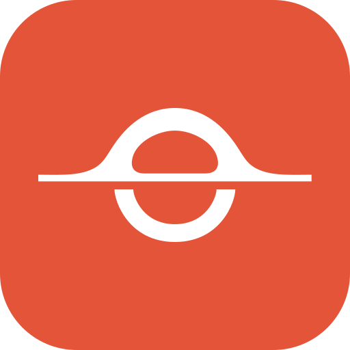
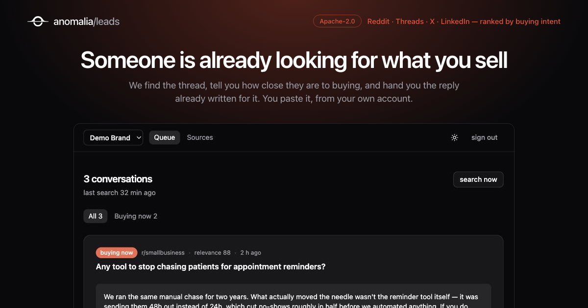

<p align="center">
  
</p>

<h1 align="center">anomalia-leads</h1>



Trova le conversazioni in cui il tuo prodotto ha davvero qualcosa da dire — su Reddit, Threads,
X e LinkedIn — le ordina per intenzione d'acquisto, e ti prepara la risposta da incollare.

Non pubblica niente al posto tuo. Il commento lo incolli tu, col tuo account: è la ragione per cui
gli account sopravvivono.

> **Stato: in costruzione.** Il motore c'è ed è coperto da test; l'applicazione attorno no.
> Vedi [Cosa manca](#cosa-manca).

## Come funziona

```
sorgenti          →  scan        →  giudizio      →  bozza          →  coda
subreddit, query     RSS, API       rilevanza +      commento + DM     tu incolli,
keyword, community                  intenzione                         segni fatto
```

Quattro idee che valgono più del codice:

- **L'intenzione è separata dalla rilevanza.** Un thread che chiede *quale strumento usate per X* e
  uno che sbraita contro X hanno la stessa rilevanza e non sono lo stesso lead.
- **Una persona, un tocco.** Il limite di contatto è globale all'istanza, non per cliente: chi ha
  già ricevuto un messaggio non viene mai più proposto a nessun altro.
- **Il silenzio è una risposta valida.** Se non c'è niente da aggiungere oltre a quello che il
  thread ha già, la bozza non si scrive.
- **Gli esiti si misurano, non si intuiscono.** Il commento viene ritrovato nel thread dopo 48 ore
  e si registra com'è andata: upvote, risposte, rimozione.

## Il motore: `packages/leads-core`

Il nucleo arriva da [anomaliaso/anomalia](https://github.com/anomaliaso/anomalia) (Apache-2.0) e
qui è **mirrorato con `git subtree`**, non copiato a mano:

```bash
npm run core:pull   # porta gli aggiornamenti dall'upstream
```

Si modifica a monte e si tira giù, così i due prodotti non divergono — e una divergenza si
presenta come conflitto di merge invece che come deriva silenziosa. Dettagli in [NOTICE](NOTICE).

Cinque moduli, nessuno dei quali dipende dal framework, dai piani o dalle variabili d'ambiente:
`intent`, `match`, `contact`, `prompts`, `feed`. Le dipendenze vere — database, gateway di
scraping, credenziali, reporter degli errori — entrano iniettate.

## Sviluppo

```bash
npm install
npm run test:unit    # include i test del core
npm run dev
```

## Cosa manca

Il motore gira ed è provato. Attorno non c'è ancora niente:

- [ ] Schema del database (quattro tabelle, elencate nel README del core)
- [ ] Autenticazione e organizzazioni
- [ ] Dashboard e coda dei lead
- [ ] Cron di scansione
- [ ] Billing

## Licenza

Apache-2.0. Vedi [LICENSE](LICENSE) e [NOTICE](NOTICE).
